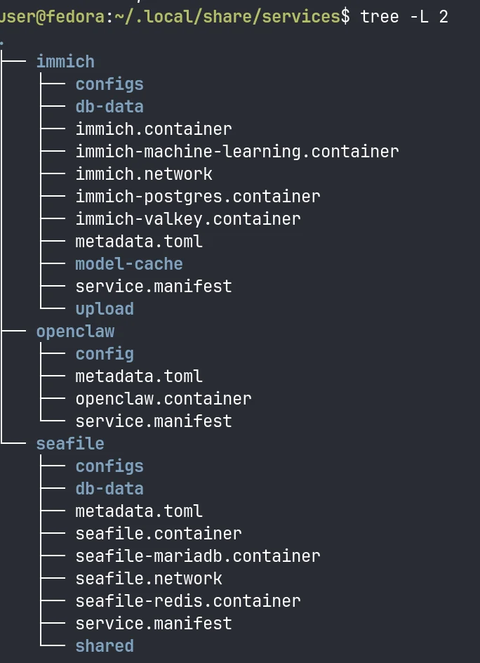
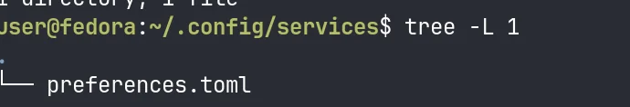
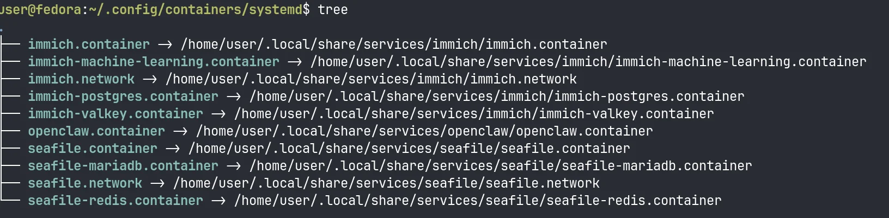

# Ryra

[](LICENCE.md)
[](https://github.com/ryanravn/ryra/actions/workflows/ci.yml)

> Self-host anything, automatically test it works.

Services arrive wired: **SSO**, **mail**, **encrypted backups**, **monitoring**. Plain rootless podman and systemd underneath, in files you can read. Every service in the [registry](https://github.com/ryanravn/ryra-registry) proven by **end-to-end tests** in a fresh VM.

```sh
$ ryra add prometheus grafana
→ wires grafana into prometheus (scrape target)
→ provisions prometheus datasource in grafana
→ starts grafana on http://127.0.0.1:3000
```

[Website](https://ryra.dev) · [Docs](https://ryra.dev/intro/) · [Services](https://ryra.dev/services/)

## Install

```sh
curl -fsSL https://ryra.dev/install.sh | sh
```

Or with Rust:

```sh
cargo install ryra
```

Works on any Linux with systemd and podman >= 5.3 (current Debian-based, Fedora, and Arch releases all qualify). `ryra doctor` checks your setup.

## Quickstart

```sh
ryra search           # browse the registry
ryra add <service>    # install one

ryra init             # ...or scaffold your own project
ryra add .            # and run your own code on ryra
```

## What it does

`ryra add <service>` reads a recipe from a curated registry and writes:

- A **rootless Podman** container, owned by your user
- A **systemd quadlet**, so `systemctl --user` and `journalctl --user` work like normal
- Optionally: a **Caddy** route with auto-HTTPS, and an **Authelia** OIDC client for SSO

Service data lives at `~/.local/share/services/<name>/`. Back it up with `tar`. Uninstall ryra and your stack keeps running, because the systemd units and containers stay.

## Why

SaaS prices keep climbing and the products keep moving slower than you want. Self-hosting is the way out, but the operational cost (compose files, reverse proxies, expiring certs, half-finished install scripts) is what stops most people from leaving.

No other self-hosting toolkit ships the full combination: rootless **podman quadlets** for security and clean systemd integration, **automated VM tests** that prove every registry service works before you install it, and a TOML-based recipe format that an AI can read and extend without hand-holding. You stay in control: customise per host, add your own services, and grow your stack at the pace your vendors won't.

## Philosophy

Ryra is a scaffolding tool, not a runtime. It writes plain files and exits, so the box ends up looking like a sysadmin set it up by hand.

### A service is a folder



Every quadlet, env file, network, and bind-mounted data directory for a service lives under `~/.local/share/services/<name>/`. Back up the whole folder with `tar`, or just the data dirs like `db-data/` and `upload/`. Move the folder to another box, the service comes with it.

### One file of preferences



SMTP credentials, OIDC provider, Tailscale key, custom registries: all the cross-service settings ryra reads at startup live in a single TOML file. The rest is just service folders.

### Symlinked into systemd



Each `.container` and `.network` is symlinked from its service folder into `~/.config/containers/systemd/`, where systemd's user generator picks it up. Remove the service and the symlink goes with it. Uninstall ryra and the symlinks plus the services keep running, because there is no ryra runtime.

## Examples

### Replace your cloud storage


```sh
ryra add seafile
```

### Replace your todo list


```sh
ryra add vikunja
```

### Run your own AI gateway


```sh
ryra add openclaw
```

### Install anything


The registry is plain TOML and quadlet files. Drop a definition in for your own app, point ryra at your registry, and install it the same way as anything in the default registry.

## Services

Run `ryra search` for the full list, or browse the [services catalog](https://ryra.dev/services/). The default registry includes Immich, Forgejo, Vaultwarden, Nextcloud, Twenty CRM, Paperless-ngx, Synapse, Supabase, Open WebUI, Authelia, Uptime Kuma, Caddy, DocuSeal, Zammad, Seafile, Vikunja, OpenClaw, and more.

## Documentation

Full docs at [ryra.dev/intro](https://ryra.dev/intro/).

## License

AGPL-3.0-or-later. See [LICENCE.md](LICENCE.md).
